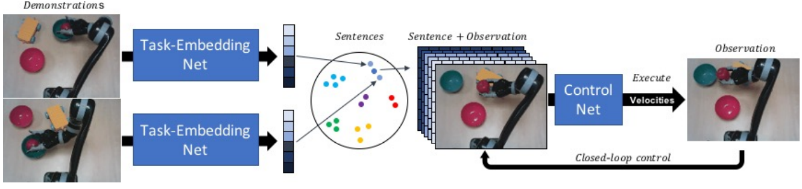

# Task Embedded Control Networks



The code presented here was used in: [Task-Embedded Control Networks for Few-Shot Imitation Learning](https://arxiv.org/abs/1810.03237).

### Running Paper Experiments

If you want to be able to re-run the experiments presented in the paper, you will need some of the dependencies from a paper that we compare against: [One-Shot Visual Imitation Learning via Meta-Learning
](https://arxiv.org/abs/1709.04905).

Follow these steps:

1. First clone the fork of the gym repo found [here](https://github.com/tianheyu927/gym), and switch to branch mil.
2. You can now either install this, or just add the gym fork to your PYTHONPATH.
3. Download the _mil_sim_reach_ and _mil_sim_push_ datsets from [here](https://www.doc.ic.ac.uk/~slj12/data/mil_data.zip). Unzip them to the _datasets_ folder. _Note: The data format here has been changed slightly in comparison to the original data from the MIL paper._
4. (Optional) Run the integration test to make sure everything is set-up correctly.

To run the reaching task, run:
```bash
./tecnets_corl_results.sh sim_reach
```
To run the pushing task, run:
```bash
./tecnets_corl_results.sh sim_push
```

### Code Design

This section is for people who wish to extend the framework.

The code in designed in a pipelined fashion, where there are a list of
consumers that takes in a dictionary of inputs (from a previous consumer)
and then outputs a combined dictionary of the inputs and outputs of that
consumer.
For example:

```python
a = GeneratorConsumer(...)
b = TaskEmbedding(...)
c = MarginLoss(...)
d = Control(...)
e = ImitationLoss(...)
consumers = [a, b, c, d, e]
p = Pipeline(consumers)
```

This allows the TecNet to be built in a modular way. For example, if one
wanted to do use a prototypical loss rather than a margin loss, then one would
only need to swap out one of these consumers. 

## Citation

```
@article{james2018task,
  title={Task-Embedded Control Networks for Few-Shot Imitation Learning},
  author={James, Stephen and Bloesch, Michael and Davison, Andrew J},
  journal={Conference on Robot Learning (CoRL)},
  year={2018}
}
```